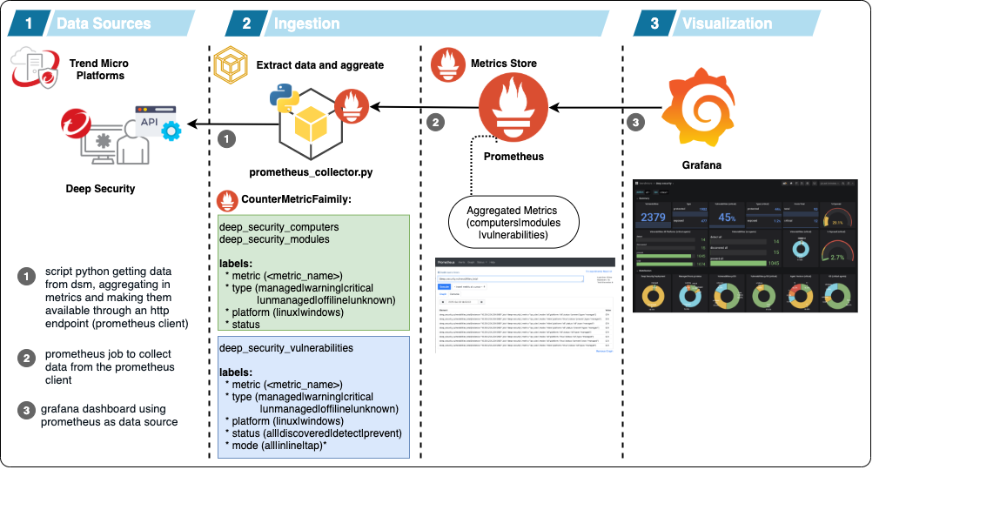
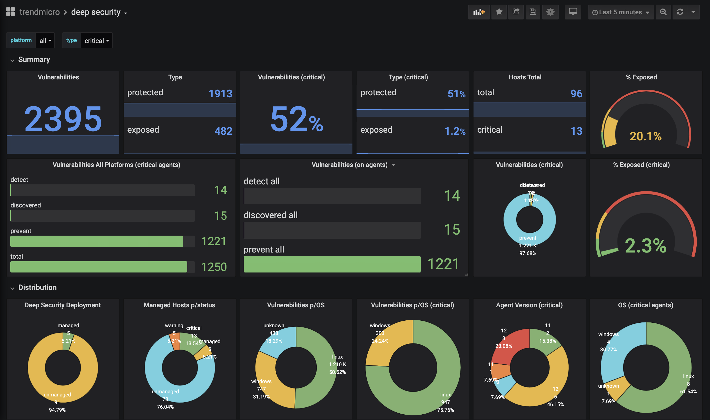
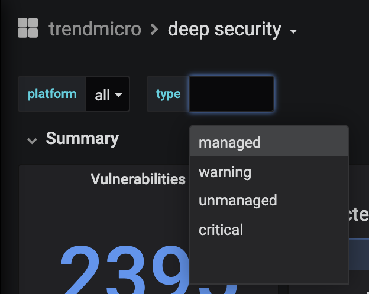

# tmds-exporter

he data is aggregated in count and segmented in 3 groups:

* deep_security_computers
* deep_security_modules
* deep_security_vulnerabilities

## 1.1 prometheus labels

* **deep_security_computers**
    * labels:
        * metric: *platform* | *os_type* | *agent_version* | *agent_version_major* 
        * type: *managed* | *warning* | *critical* | *unmanaged* | *offline* | *unknown*
        * platform: *all* | *linux* | *windows*
        * status: *(os version)* | *(agent version)*
  
* **deep_security_modules**
    * labels:
       * metric: *am_status* | *wr_status* | *fw_status* | *ip_status* | *im_status* | *li_status*
       * type: *managed* | *warning* | *critical* | *unmanaged* | *offline* | *unknown*
       * platform: *all* | *linux* | *windows*
       * status: *on* | *off*
  
* **deep_security_vulnerabilities**
    * labels:
       * metric: *am_status* | *wr_status* | *fw_status* | *ip_status* | *im_status* | *li_status*
       * type: *managed* | *warning* | *critical* | *unmanaged* | *offline* | *unknown*
       * platform: *linux* | *windows*
       * status: *all* | *discovered* | *detect* | *prevent*

About vulnerabilities status:

* **discovered:** vulnerabilities that are detected but the IPS is not enabled on the host
* **detect:** vulnerabilities with IPS enabled but configured on detect mode
* **prevent:** vulnerabilities with IPS enabled and configured on prevent mode

## 1.2 environment:

* **python**: *python 2.7* (required)
* **prometheus**: *v2.16* (tested with this version)
* **grafana**: *6.6.2* (tested with this version)

## 1.3 configuration

### 1.3.1 create a virtual environment

#### 1.3.1.1 virtualenv

install deep security sdk:

~~~sh
pipenv --three
pipenv shell
python3 -m pip install third_party/dsm-py-sdk/
pip install -r requirements.txt
~~~

## 1.3.2 running the app:

You should configure a config.py (**renaming config_sample.py to config.py** with your configuration), or using environment variables, to configure:

| Variable    | Description                    | Value                          | Value Type  |
|-------------|--------------------------------|--------------------------------|-------------|
|DS_HOST      | DSM Hostname                   | ip|fqdn                        | string|
|DS_APY_KEY   | DSM APY KEY                    | apy key                        | string|
|DS_VERIFY_SSL| SSL Verify                     | True|False                     | boolean|
|DS_API_CHECK | Cache API data                 | time in minutes                | integer|
|SERVER_PORT  | Prometheus Collector TCP Port  | port number                    | integer|
|LOG_LEVEL    | Log level                      | INFO|WARN|DEBUG|ERROR|CRITICAL | string|

### 1.3.3 grafana dashboard:

Import the dashboard located on: grafana/dash.json

* **dashboard:**

* **filtering by type:** 
  

### 1.3.4 the collector: 

~~~
curl localhost:9090
~~~

## References:

### Prometheus Collector:

I've based the collector structure on this example [https://github.com/jakirpatel/prometheus-custom-collector/blob/master/code/collector.py](https://github.com/jakirpatel/prometheus-custom-collector/blob/master/code/collector.py) developed by @jakirpatel.

## Support:

This project is not part of any Trend Micro Deep Security project and it is not supported by Trend Micro. 

Use and adapt to your needs and PRs are welcomed.

